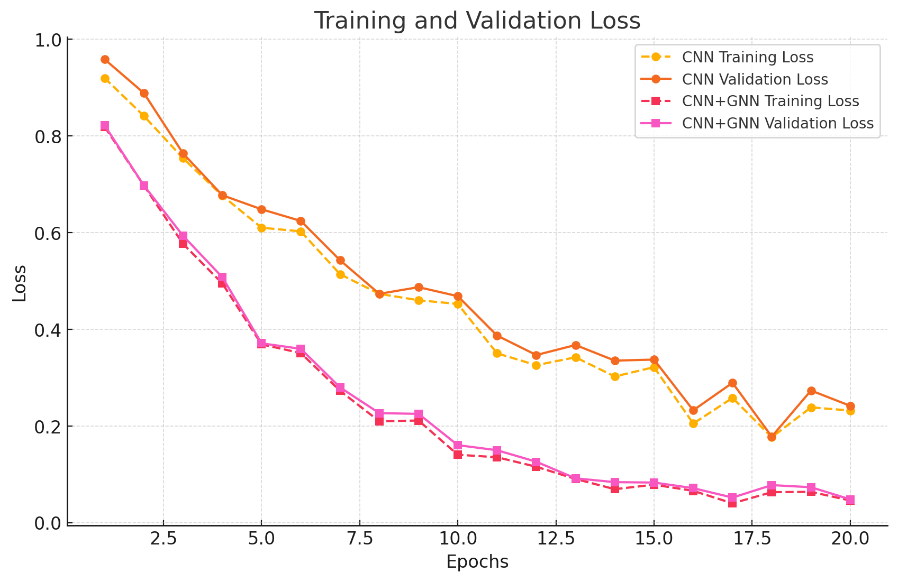
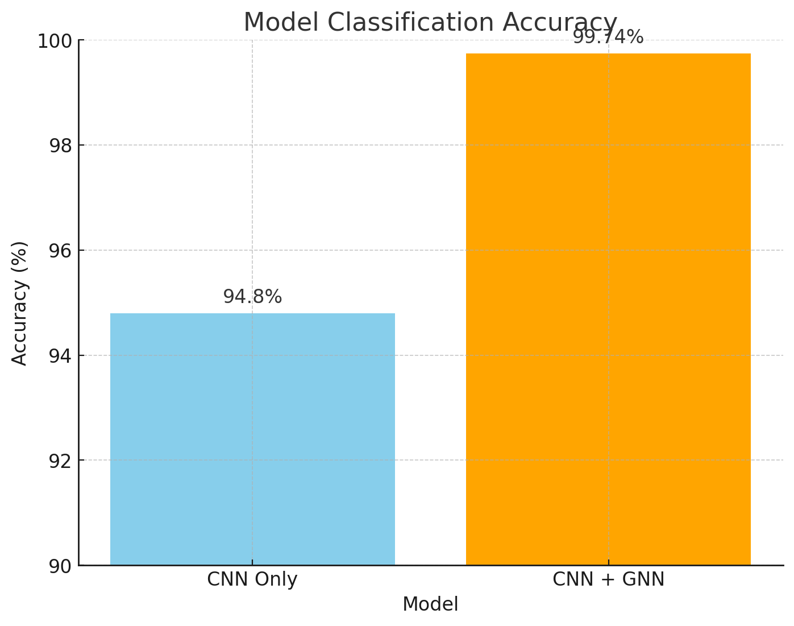
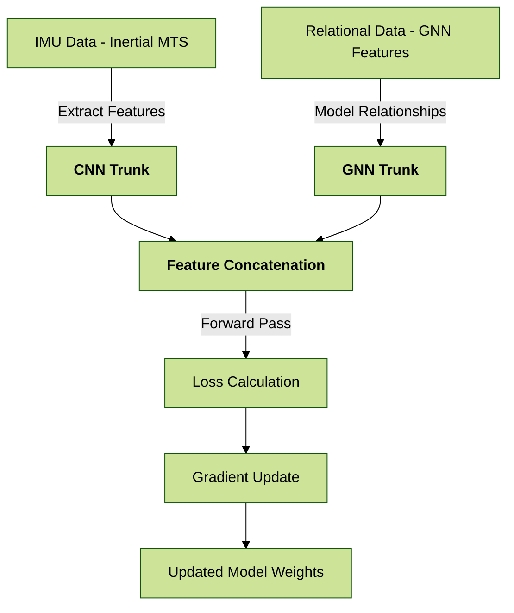
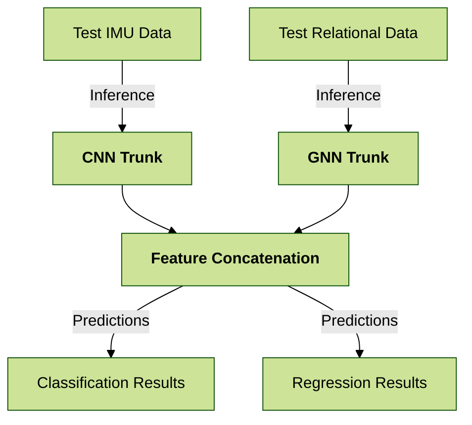
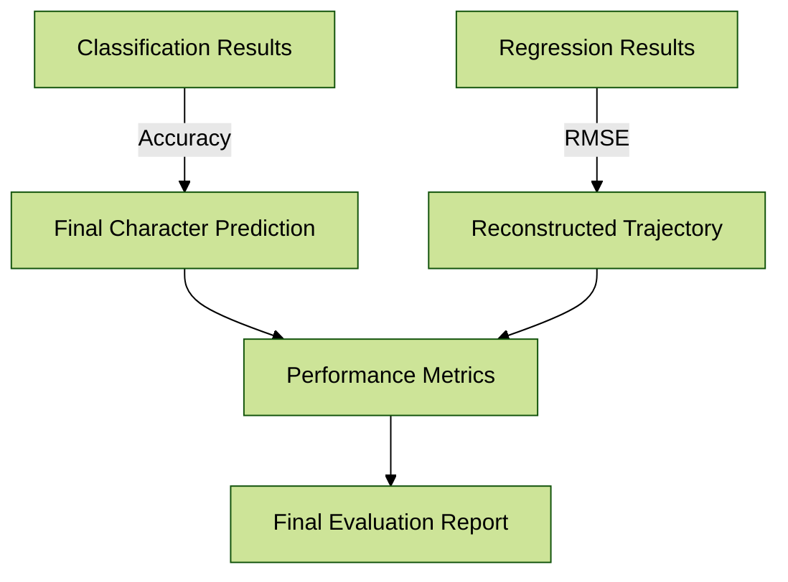

# **IMU Character Recognition with CNN + GNN**

This project implements a state-of-the-art handwriting recognition pipeline using **Convolutional Neural Networks (CNN)** and **Graph Neural Networks (GNN)** in a **Multi-Task Learning (MTL)** framework. The approach jointly optimizes character classification and trajectory regression tasks. This novel architecture builds on the principles discussed in *Joint Classification and Trajectory Regression of Online Handwriting Using a Multi-Task Learning Approach* and achieves substantial improvements over baseline methods.

The current model achieves a classification accuracy of **99.74%** on the **OnHW Dataset**, improving significantly over the baseline CNN model (94.8%). Furthermore, the trajectory prediction component achieves smoother and more accurate results compared to previous approaches.

---

## **Features**

### **1. Hybrid CNN-GNN Architecture**

- **CNN Component**:
  - Extracts temporal and spatial features from the IMU sensor data.
- **GNN Component**:
  - Captures relational structures and interdependencies in multi-channel sensor data.
  
### **2. Multi-Task Learning (MTL)**

- Simultaneously solves two tasks:
  - **Character Classification**: Maps IMU features to character labels.
  - **Trajectory Regression**: Reconstructs handwriting trajectories for visualization and analysis.

### **3. Symbol and Equation Recognition**

- Extended pipeline supports classification of mathematical symbols and multi-character equations.

### **4. Advanced Loss Strategies**

- Combines:
  - **Cross-Entropy Loss** for classification.
  - **Distance, Spatio-Temporal, and Distribution-Based Losses** for regression.

---

## **Dataset**

The [OnHW Dataset](https://www.iis.fraunhofer.de/de/ff/lv/dataanalytics/anwproj/schreibtrainer/onhw-dataset.html) includes:

- **13 IMU Channels**: Data from accelerometers, gyroscope, magnetometer, and force sensors.
- **Variable-Length Sequences**: Handwriting samples of varying lengths.
- **Ground Truth Labels**: Characters, symbols, and trajectories.

The dataset is preprocessed to normalize IMU data and interpolate sequences to a uniform length.

---

## **How to Use**

### **1. Install Dependencies**

```bash
pip install -r requirements.txt
```

### **2. Preprocess the Train the model**

```bash
python cnn_gnn.py
```

---

## **Analysis**

### **Accuracy Comparison**

| Model        | Classification Accuracy (%) |
|--------------|-----------------------------|
| **Baseline CNN** | 94.8                      |
| **CNN + GNN**   | **99.74**                 |

### **MTL Loss Combination Insights**

The table below compares different combinations of loss functions for trajectory regression and character classification:

| Loss Combination      | Classification Accuracy (%) | Regression Error (RMSE) |
|------------------------|-----------------------------|--------------------------|
| **MSE + CrossEntropy** | 86.69                      | 0.1169                   |
| **Huber + CrossEntropy** | 88.43                    | 0.1533                   |
| **MSE + PearsonCorrelation** | 87.03              | 0.1490                   |
| **MSE + Wasserstein**   | 88.15                     | 0.1530                   |

### **Error Analysis**

Mismatched predictions primarily occur with visually similar characters. For example:

- `P` is often mistaken for `D`.
- `g` is mistaken for `y`.

To reduce errors, the following strategies are recommended:

- Data augmentation to increase diversity.
- Weighted losses focusing on difficult samples.

## **Loss and Accuracy Plots**

<table>
  <tr>
    <td>
      
    </td>
    <td>
      
    </td>
  </tr>
</table>

---

## **Suggestions for Further Improvements**

### **1. Advanced Architectures**

- Implement **Graph Attention Networks (GAT)** for improved relational modeling.
- Incorporate **Transformer-based Models** for enhanced sequence-to-sequence learning.

### **2. Data Augmentation**

- Introduce simulated IMU data with noise, shifts, and rotations to improve generalization.

### **3. Real-Time Optimization**

- Convert models to lightweight formats (e.g., TensorFlow Lite or ONNX) for deployment on resource-constrained devices.

---

## **Visualization of Architecture**

### **Training Process**



---

### **Evaluation Process**



---

### **Results Overview**



---

## **Paper and References**

This project builds upon the methodology presented in:

- **Paper**: *Joint Classification and Trajectory Regression of Online Handwriting Using a Multi-Task Learning Approach*.
- **Citation**:

```bibtex
@inproceedings{ott2022joint,
  title={Joint Classification and Trajectory Regression of Online Handwriting Using a Multi-Task Learning Approach},
  author={Ott, Felix and Rügamer, David and Heublein, Lucas and Bischl, Bernd and Mutschler, Christopher},
  booktitle={IEEE Winter Conference on Applications of Computer Vision (WACV)},
  pages={266--276},
  year={2022}
}
```

### **Resources**

- Dataset: [OnHW Dataset](https://www.iis.fraunhofer.de/de/ff/lv/dataanalytics/anwproj/schreibtrainer/onhw-dataset.html)
- Paper: [PDF](data/WACV2022_paper.pdf)

---

## License

This project is licensed under the InkShare IMU2Text License, which allows academic, personal, and non-commercial use. Commercial use requires prior authorization from InkShare.

For details, see the [LICENSE](LICENSE) file.

For inquiries about commercial use or licensing, please contact: vkosuri@inkshare.com.
