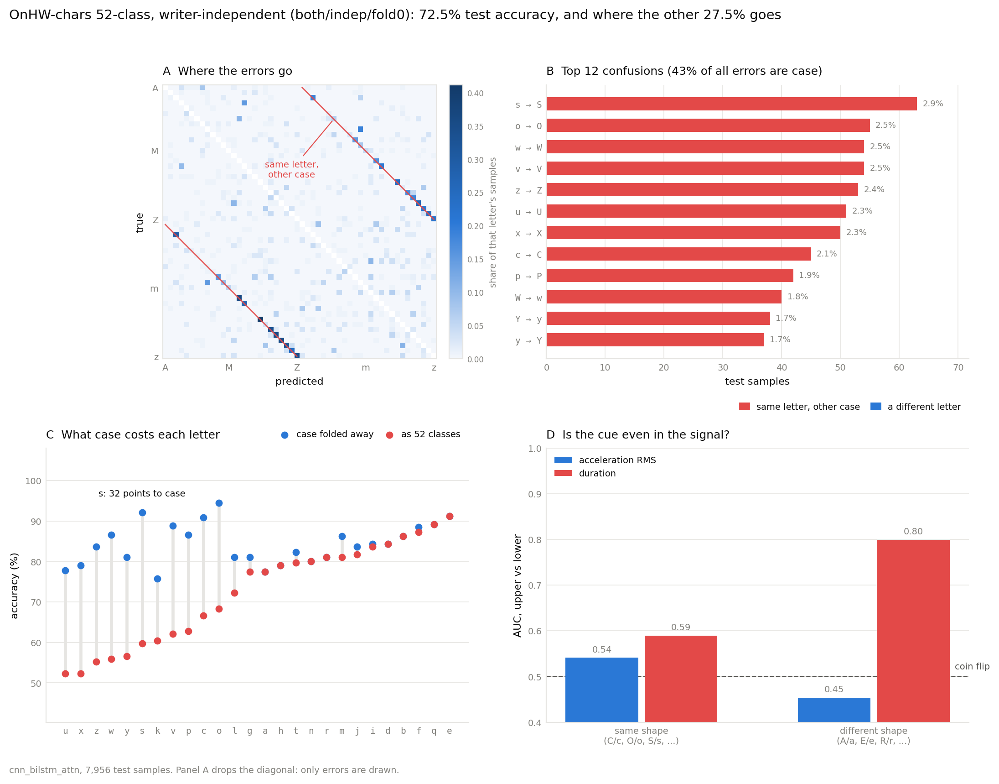

# imu2text

Handwriting recognition from a sensor-enhanced ballpoint pen. Trains and
evaluates on the Fraunhofer IIS OnHW datasets (13 IMU channels at 100 Hz) and
reports writer-independent accuracy on the official splits.

## Install

```bash
pip install -r requirements.txt --extra-index-url https://download.pytorch.org/whl/cpu
```

Python 3.10. The pins are security-motivated (`torch==2.13.0`,
`scikit-learn==1.5.2`); check the advisories before loosening them.

## Train

```bash
python -m imu2text.download onhw_chars --out ./data          # 896 MB, once

python -m imu2text.models --models cnn_bilstm_attn \
    --onhw-chars data/onhw-chars_2021-06-30 \
    --case both --dependency indep --fold 0 \
    --augment 2 --aug-policy extended \
    --label-smoothing 0.1 --lr-schedule --epochs 30
```

`--case` is `lower`, `upper` or `both`; `--dependency indep` is the
writer-independent protocol. `--deterministic` makes a run bit-reproducible,
which any before/after comparison needs.

Sequence-to-sequence recognition for words and equations:

```bash
python -m imu2text.seq2seq --demo        # synthetic, no download
```

## Results

OnHW-chars, official `both/indep/fold0` split, 52 classes, writer-independent:

| Model | Train % | WI Test % |
|---|--:|--:|
| CNN+BiLSTM | 90.1 | 69.2 |
| + augmentation ×2 | 90.1 | 70.0 |
| CNN+BiLSTM + attention pooling, augmentation, label smoothing, LR schedule | 92.1 | **72.5** |
| CNN+BiLSTM (Ott et al., ACM MM 2022, Table 3) | - | 68.06 |

Single seed, fold 0, CPU-only. 43% of the remaining errors are a letter
confused with its own other case, which the IMU cannot resolve: scored
case-insensitively the same model reads 84.3%.



Full tables, the accuracy ceiling and the machine specification are in
[docs/benchmarks.md](docs/benchmarks.md).

## Run the benchmark

```bash
python scripts/make_comparison_table.py --config best --epochs 30
python scripts/plot_error_analysis.py \
    --predictions results/predictions_official_fold0.npz \
    --onhw-chars data/onhw-chars_2021-06-30
python scripts/plot_architecture.py
```

## Contributing

Contributions are welcome. Run `pytest`, `black` and `pylint` before opening a
pull request; CI gates all three. Working rules are in
[CLAUDE.md](CLAUDE.md).

## License

MIT. Maintained by [@vahinitech](https://github.com/vahinitech).
