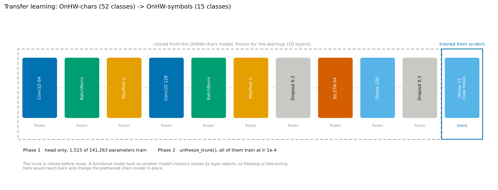

# Benchmark results

Results, error analysis and the accuracy ceiling for the OnHW tasks; the README
has the short version. WI is writer-independent (whole writers held out), WD is
writer-dependent, CRR is character recognition rate. CER and WER are error
rates, so lower is better. Quote the official benchmark (72.5% WI) against the
literature; the OnHW-chars_L figures only track changes within this repo.

## At a glance

"Published" is the CNN+BiLSTM row of Ott et al., ACM MM 2022, Tables 2 and 3,
right-handed writers.

| Task | Split | Ours | Published | Details |
|---|---|--:|--:|---|
| OnHW-chars, 52 classes | official WI, fold 0 | **72.46** | 68.06 | [OnHW-chars](#onhw-chars-official-benchmark) |
| OnHW-chars, 26 lower / upper | official WI | 82.45 / 86.78 | 79.48 / 85.60 | [OnHW-chars](#onhw-chars-official-benchmark) |
| OnHW-chars, 52 classes, case-insensitive | official WI | 84.34 | n/a | [Error analysis](#where-the-remaining-error-is) |
| OnHW-chars, 52 classes, 5-seed ensemble | official WI, fold 0 | **74.46** | n/a | [Uncertainty](uncertainty.md#results) |
| OnHW-symbols, 15 classes | official WI | 72.83 | 79.51 | [Symbols and equations](#onhw-symbols-and-onhw-equations) |
| OnHW-equations (split), 15 classes | official WI | **87.04** | 83.88 | [Symbols and equations](#onhw-symbols-and-onhw-equations) |
| OnHW-words500, 30 epochs, lexicon | official WI | CER 32.65 / WER 40.23 | not in these tables | [Words](#onhw-words500) |
| OnHW-words500, 15 epochs, refit, greedy | `Words500_indep_02` fold 0 | CER 53.95% / WER 91.10% | n/a | [Words](#onhw-words500) |
| OnHW-chars_L (left-handed), 52 classes | constructed WI, 9 writers | 26.86 | n/a | [Coverage](#coverage-by-dataset) |

The 52-class ceiling is the sensor: 43.1% of the remaining errors are a letter
read as its own other case.

## Coverage by dataset

| Dataset | Task | Classes | Samples | Model trained | Split | Ours | Published |
|---|---|--:|--:|---|---|--:|--:|
| OnHW-chars, right | classification | 52 | 31,275 | CNN+BiLSTM+attn, aug, LS, LR sched | official WD | 80.07 | 78.17 |
| OnHW-chars, right | classification | 52 | 31,275 | same | official WI | **72.46** | 68.06 |
| OnHW-chars, right | classification | 26 lower | 15,625 | same | official WD | 88.25 | 88.85 |
| OnHW-chars, right | classification | 26 lower | 15,625 | same | official WI | 82.45 | 79.48 |
| OnHW-chars, right | classification | 26 upper | 15,650 | same | official WD | 91.43 | 92.15 |
| OnHW-chars, right | classification | 26 upper | 15,650 | same | official WI | 86.78 | 85.60 |
| OnHW-chars, left | classification | 52 | 2,270 | same | constructed random | 72.91 | 82.80 |
| OnHW-chars, left | classification | 52 | 2,270 | same | constructed WI | 26.86 | 32.00 |
| OnHW-chars, left | classification | 26 lower | ~1,135 | same | constructed random | 77.78 | 94.70 |
| OnHW-chars, left | classification | 26 lower | ~1,135 | same | constructed WI | 25.96 | 43.60 |
| OnHW-chars, left | classification | 26 upper | ~1,135 | same | constructed random | 77.39 | 91.90 |
| OnHW-chars, left | classification | 26 upper | ~1,135 | same | constructed WI | 34.93 | 43.62 |
| OnHW-symbols | classification | 15 | 2,326 | same | official WD | 95.77 | 96.20 |
| OnHW-symbols | classification | 15 | 2,326 | same | official WI | 72.83 | 79.51 |
| OnHW-equations, split | classification | 15 | 39,643 | CNN+BiLSTM+attn | official WD | 95.33 | 95.70 |
| OnHW-equations, split | classification | 15 | 39,643 | CNN+BiLSTM+attn | official WI | **87.04** | 83.88 |
| OnHW-words500 | seq2seq, CTC | 59 charset | 25,207 | CNN+BiLSTM+CTC, greedy | official WI | CER 38.08 / WER 73.17 | not in these tables |
| OnHW-words500 | seq2seq, CTC | 59 charset | 25,207 | same, lexicon-constrained | official WI | **CER 32.65 / WER 40.23** | not in these tables |
| OnHW-wordsRandom | seq2seq, CTC | 59 charset | 14,641 | none | n/a | n/a | n/a |
| OnHW-wordsTraj | seq2seq + trajectory | 59 charset | 16,752 | none | n/a | n/a | n/a |

Left-handed rows are indicative only. OnHW-chars_L is 2,270 samples from 9
writers as flat pickles with **no official splits**; Ott et al. built their own
and ours are built separately, so no cell is like-for-like. Our "random" column
is not a writer-dependent split, and run-to-run spread is about 5 points against
0.2 on the right-handed archive. `imu2text/chars.py` loads real writer IDs, so
`make_split(mode="writer")` works on it.

Loaders exist for every dataset above except wordsRandom and wordsTraj.
wordsTraj also needs a trajectory error metric and has 2 writers, so it has no
WI split. `imu2text/words.py` loads OnHW-words500 and implements
lexicon-constrained CTC decoding. Open work: issue
[#11](https://github.com/vahinitech/imu2text/issues/11) and the trajectory
thread in [roadmap.md](roadmap.md).

## OnHW-chars, official benchmark

The published dataset and splits: 31,275 samples, 119 writers, 52 classes,
`both/indep/fold0`. The download is 896 MB.

```bash
python -m imu2text.download onhw_chars --out ./data
python -m imu2text.models --models cnn_bilstm_attn \
    --onhw-chars data/onhw-chars_2021-06-30 \
    --case both --dependency indep --fold 0 \
    --augment 2 --aug-policy extended \
    --label-smoothing 0.1 --lr-schedule --epochs 30
```

CNN+BiLSTM, 30 epochs, seed 0, official train/test partition:

| Configuration | Train % | WI Test % |
|---|--:|--:|
| 1×BiLSTM-64 | 90.1 | 69.2 |
| 1×BiLSTM-64, attention pooling | 89.4 | 69.0 |
| 1×BiLSTM-64 + augmentation ×2 (`extended`) | 90.1 | 70.0 |
| 2×BiLSTM-100 | 95.5 | 69.6 |
| 2×BiLSTM-100 + label smoothing 0.1 + LR schedule | 98.1 | 70.8 |
| 2×BiLSTM-100 + those + augmentation ×2 | 99.2 | 70.4 |
| 1×BiLSTM-64, attention pooling + augmentation ×2 | 89.5 | 70.9 |
| **the same + label smoothing 0.1 + LR schedule** | 92.1 | **72.5** |
| majority baseline | n/a | 1.9 |

Single seed, fold 0. With `--deterministic` the baseline and best rows give
69.29% and 72.26%, both within 0.2 points. The best row is 3.3 points above
1×BiLSTM-64 with a third of the parameters of 2×BiLSTM-100.

The train column tells the story. Capacity buys +0.4 (2×100 over 1×64) while
train accuracy climbs from 90% to 95%. Stack every regulariser on the big model
and it memorises the augmented copies too: 99.2% train, 70.4% test. The small
model with every lever on holds train to 92.1%, eight points below the 2×100
models, and that restraint becomes test accuracy. Attention pooling alone was a
wash (69.0 against 69.2); with augmentation it adds +0.9, and label smoothing
plus the LR schedule add another +1.6 (`--models cnn_bilstm_attn`).

### Against Ott et al., Table 3

Six official splits, fold 0, 30 epochs, single seed. Published rows are Ott et
al., ACM MM 2022, Table 3, right-handed writers.

| Method | Lower WD | Lower WI | Upper WD | Upper WI | Comb WD | Comb WI |
|---|--:|--:|--:|--:|--:|--:|
| CNN+BiLSTM [60] | 88.85 | 79.48 | 92.15 | 85.60 | 78.17 | 68.06 |
| InceptionTime [25] | 84.14 | 75.28 | 87.80 | 81.62 | 70.43 | 61.68 |
| ResNet [86] | 83.01 | 71.93 | 86.41 | 78.03 | 68.56 | 58.74 |
| LSTM-FCN [45] | 81.43 | 71.41 | 85.43 | 77.07 | 67.34 | 57.93 |
| CNN+BiLSTM (this repo) | 85.35 | 80.24 | 88.29 | 82.98 | 75.79 | 67.32 |
| **CNN+BiLSTM+attn, aug x2, LS, LR sched** | 88.25 | **82.45** | 91.43 | **86.78** | **80.07** | **72.46** |

```bash
python scripts/make_comparison_table.py --config best --epochs 30
```

Our plain CNN+BiLSTM is within 0.7-3.9 points of theirs, above on lower WI. The
tuned one leads on all three WI cells (+2.97, +1.18, +4.40) and combined WD
(+1.90), and trails by 0.60 and 0.72 (0.6-0.7) on the two single-case WD cells.

Table 4 of the same paper is not comparable. It measures supervised domain
adaptation from right- to **left-handed** writers, scored on a small
left-handed validation set: its baseline is 25.19% combined and adaptation
lifts it to ~96%, hence 85.09 (kMMD, OnHW-symbols) and 100.00 (OnHW-chars
lower). This repo does no domain adaptation.

### Checkpoint regression

`cnn_bilstm_attn` was rerun before and after the evaluation fix on
`both/indep/fold0`: 31,275 raw recordings, 23,316 nonempty official training
recordings, 7,956 test recordings, 52 classes, inner fitting/validation
19,819/3,497, two augmented copies giving 59,457 fitting examples. Both seed-0
deterministic runs score **72.26%** with **zero changed test predictions** and
91.24%/81.41% train/validation accuracy. See the
[run metadata](../results/ctc/character_runs.json) and
[error breakdowns](../results/ctc/chars_fixed_seed0.txt).

## Where the remaining error is

```bash
python -m imu2text.models --models cnn_bilstm_attn \
    --onhw-chars data/onhw-chars_2021-06-30 --case both --dependency indep \
    --fold 0 --epochs 30 --augment 2 --aug-policy extended \
    --label-smoothing 0.1 --lr-schedule --error-analysis
```

```
Error analysis on 7956 test samples (2191 wrong, 27.54% error)
case-insensitive accuracy : 84.34%  (plain: 72.46%)
errors that are case only : 945/2191 (43.1% of all errors)
top 12 confusions: 's'->'S' 'o'->'O' 'w'->'W' 'v'->'V' 'z'->'Z' 'u'->'U'
                   'x'->'X' 'c'->'C' 'p'->'P' 'W'->'w' 'Y'->'y' 'y'->'Y'
```

All twelve top confusions of the 72.5% model are a letter read as its own other
case; folding case gives 84.3%, so about twelve points of error is upper versus
lower. The 20-epoch baseline had 38.4% of its errors in case; going from 68.0%
to 72.5% raised the share to 43.1% because the fixable errors got fixed.


```bash
python -m imu2text.models --models cnn_bilstm_attn \
    --onhw-chars data/onhw-chars_2021-06-30 --case both --dependency indep \
    --fold 0 --epochs 30 --augment 2 --aug-policy extended \
    --label-smoothing 0.1 --lr-schedule \
    --save-predictions results/predictions_official_fold0.npz

python scripts/plot_error_analysis.py \
    --predictions results/predictions_official_fold0.npz \
    --onhw-chars data/onhw-chars_2021-06-30
```

Panel A drops the diagonal; the two red lines, 26 off it, are where same-letter
case errors land, and almost all the mass is there. Values are in
`results/error_analysis_confusions.csv`.

**The sensor cannot resolve it.** For same-shape pairs (C/c, O/o, S/s, U/u, V/v,
W/w, X/x, Z/z, K/k, P/p) only size differs, and an IMU measures acceleration,
not position. AUC over the test set (0.5 = a coin flip):

| Cue | Same-shape pairs | Differently-shaped pairs (A/a, E/e, R/r, B/b, H/h) |
|---|--:|--:|
| Acceleration RMS | 0.541 | 0.36–0.54 |
| Sequence duration | 0.590 | 0.83–0.95 |

Acceleration scales as size / time², and capitals are written both larger and
proportionally faster, so the two cancel. Duration does not help either:
same-shape pairs differ in length by a factor of 1.08, against 1.31 for
differently-shaped pairs.

Removing case confirms it (same model, 20 epochs, `indep/fold0`):

| Task | WI Test % |
|---|--:|
| 52-class (`--case both`) | 68.0 |
| the same model scored case-insensitively | 80.3 |
| 26-class lowercase (`--case lower`) | 78.5 |
| 26-class uppercase (`--case upper`) | 81.8 |

All three land near 80%, and the un-augmented 81.8% is near the published
uppercase WI figure (85.60, CNN+BiLSTM, Ott et al., ACM MM 2022, Table 3). Wehbi et al., "Towards an IMU-based Pen Online
Handwriting Recognizer" (FAU Erlangen, their own word dataset) found 26% of a
CTC word model's errors were substitutions "between characters that look
similar in both uppercase and lowercase, such as 'P-p', 'K-k', and 'S-s'"; the
other 68% were cursive segmentation errors.

So capacity bought +0.4, and regularisation, which works on the 61.6% of the 68.0% baseline's
errors that are not case, bought more. A bigger model will not move the ceiling. These
would: score a 26-class split (they ship for this reason; say which you ran),
give the model word context so case follows position ("cat" and "Cat"), as a
word-level CTC model with a lexicon does (`imu2text/seq2seq.py`,
`docs/roadmap.md`), or add a sensor that sees position, like the
tablet-and-camera rig behind OnHW-wordsTraj.

## OnHW-symbols and OnHW-equations

Published rows: Ott et al., ACM MM 2022, Table 2, right-handed writers. Each
archive's own train/val split. **Symbols:** 15 classes (digits 0-9 and `+`,
`-`, `·`, `:`, `=`), 2,326 samples from 27 writers. **Equations (split):** the
`_e` files, 39,643 per-symbol slices from 10,713 equations, same charset.

| Method | Symbols WD | Symbols WI | Equations WD | Equations WI |
|---|--:|--:|--:|--:|
| CNN+BiLSTM [60] | 96.20 | 79.51 | 95.70 | 83.88 |
| InceptionTime [25] | 91.97 | 76.92 | 94.87 | 84.35 |
| ResNet [86] | 94.50 | 77.41 | 94.68 | 83.45 |
| CNN+BiLSTM+attn (this repo) | 90.49 | 71.52 | 95.33 | **87.04** |
| CNN+BiLSTM+attn, aug x2, LS, LR sched | **95.77** | **72.83** | **96.25** | 86.12 |

| Dataset | Train samples | Published WI | Ours WI | Delta |
|---|--:|--:|--:|--:|
| OnHW-symbols | 1,575 | 79.51 | 72.83 | -6.68 |
| OnHW-chars (52-class) | 19,819 | 68.06 | 72.46 | +4.40 |
| OnHW-equations (split) | 26,942 | 83.88 | 87.04 | +3.16 |

Ahead on the two larger sets, behind on the small one: regularisation needs
data. On symbols the tuned config is -0.43 on WD and 6.7 behind on WI, adding
1.3 points on WI against 5.3 on WD. On equations, the largest set, it is 0.92
*behind* the plain config on WI (3.2 ahead of published), the only split where
that happens, like the 2xBiLSTM-100 rows on OnHW-chars. Transfer learning from
OnHW-chars (`imu2text/symbols.py`) targets the small case and is unmeasured.

The playground uses deterministic reruns of the tuned configuration (seed 0,
30 epochs, `--deterministic`, predictions saved in `results/tasks/`):
symbols WD 94.71% (473 test samples) and WI 71.03% (611). The table's 95.77
and 72.83 are the same configuration without `--deterministic`, so the
difference is run-to-run variation on a small test set, not a change.
Equations and OnHW-chars WD have not been rerun this way yet.

## OnHW-words500

### 30-epoch run

25,207 samples, 53 writers, the archive's writer-disjoint split (42 train
writers, and 11 held-out writers in the archive's `val` half, scored here as
the test set). CNN+BiLSTM with a CTC head, 30 epochs, `--max-len 400`,
single seed.

| Decoding | CER | WER |
|---|--:|--:|
| Greedy | 38.08 | 73.17 |
| Lexicon-constrained beam search | **32.65** | **40.23** |

All 500 val words appear in train, so decoding can be restricted to them. That
cuts WER by 32.9 points (73.17 to 40.23), a 45% relative reduction with the same
model: greedy errors are mostly one or two edits from a real word (`ging` read
as `sing`, `wir` as `nir`). This is the first test of `LexiconDecoder` on a
trained model. On the synthetic open-vocabulary demo it made CER worse, 69.81
against 0.00, because the target is outside the vocabulary. No published
words500 figure is available: the IJDAR 2022 paper is not among the PDFs in
`/home/vishnu/datasets/papers`.

### Alignment and writer-validation study (15 epochs)

`Words500_indep_02`, **published WI fold 0**, **59 character symbols** plus the
CTC blank: 25,218 raw recordings from 53 writers. Dropping three empty training
and eight empty test recordings leaves 19,915 and 5,292. The 11 test writers
are in no fitting partition. Seed 0, deterministic TensorFlow ops,
single-threaded, 15 epochs, batch 32, a CNN with one 32-unit bidirectional
LSTM. A limited CPU experiment, not the CLI default or a converged five-fold
result. Exact word accuracy counts whole-word matches.

| Pipeline | Fitting / validation recordings | CER ↓ | WER ↓ | Exact word accuracy ↑ |
|---|---:|---:|---:|---:|
| Parent `03d1c8f`, random inner validation | 16,927 / 2,988 | 59.30% | 94.46% | 5.54% |
| Corrected, same random inner validation | 16,927 / 2,988 | 55.70% | 92.23% | 7.77% |
| Corrected, writer-disjoint inner validation | 16,416 / 3,499 | 59.31% | 94.50% | 5.50% |
| Same writer-validation model, training-only lexicon | 16,416 / 3,499 | 65.35% | 77.23% | 22.77% |
| Final refit on all official training writers, greedy | 19,915 / n/a | 53.95% | 91.10% | 8.90% |
| Same final refit, training-only lexicon | 19,915 / n/a | 56.85% | 67.27% | 32.73% |

- **Same split:** the fix cuts CER by **3.60 percentage points** (paired
  bootstrap over the 11 test writers, 95% interval 1.52–5.67). One run.
- **Writer-disjoint validation** (seven training writers held out, 35 left)
  removes that gain at this budget (interval −1.40–1.40), so this does **not**
  support a greedy-accuracy improvement claim.
- **Repeats:** parent and grouped-validation configs each ran twice at the same
  seed with identical loss histories and **zero changed test predictions**, a
  spread of 0.00 percentage points in CER. Seeds, folds and hardware were not
  varied.
- **Final refit:** a fresh model on all 42 official training writers for the
  validation-selected epoch 15, which is also the last epoch of the budget;
  validation loss was still falling (11.14 to 10.79 over the last two epochs of
  `fixed_seed0_run1.json`), so every word model here is under-trained. Greedy
  CER drops **5.35 percentage points** against the parent (95% interval
  **2.77–7.76**), mixing the pipeline changes with more data, writers and
  updates. One run, not an isolated test of masking. Training CER is 23.70% and
  training exact word accuracy 32.57%.
- **Lexicon:** more whole words, more character edits when it picks wrong or
  abstains, so lower WER is not lower CER. Empty outputs: 1,817 strict against
  243 greedy. The final lexicon has 501 training strings (the 500 words plus
  `Stabilo`), returns 1,348 empty results, and reaches 32.73% exact accuracy
  with higher CER than greedy. In the 30-epoch run the lexicon lowered CER
  instead (38.08 to 32.65); the two runs differ in epochs and training data,
  and this study did not isolate why.

Host: AMD EPYC 9354P, four logical CPUs, 7.75 GiB RAM, Python 3.10.21,
TensorFlow 2.15.1, NumPy 1.26.4; refit plus evaluation took 1,627 seconds
([environment.json](../results/ctc/environment.json)). The
[root-cause analysis](rca_ctc_lengths.md) covers the alignment defects and
limits; configs, histories and paired predictions are in
[results/ctc](../results/ctc/) with the
[protocol and archive checksums](../results/ctc/protocol.json).

Reproduce from the repo root with the archive under `data/Words500_indep_02`.
The runner sets seed 0, deterministic ops and one thread. Run jobs one at a
time; a concurrent real-data test run exceeded this machine's memory.

```bash
python -m scripts.benchmark_ctc --data data/Words500_indep_02 --implementation parent --output results/ctc/parent_seed0_run1.json
python -m scripts.benchmark_ctc --data data/Words500_indep_02 --implementation fixed --lexicon --output results/ctc/fixed_seed0_run1.json
python -m scripts.benchmark_ctc --data data/Words500_indep_02 --implementation parent --output results/ctc/parent_seed0_run2.json
python -m scripts.benchmark_ctc --data data/Words500_indep_02 --implementation fixed --output results/ctc/fixed_seed0_run2.json
python -m scripts.benchmark_ctc --data data/Words500_indep_02 --implementation fixed-random --output results/ctc/fixed_random_seed0_run1.json
python -m scripts.summarize_ctc --data data/Words500_indep_02
python -m scripts.refit_ctc --data data/Words500_indep_02 --selection results/ctc/fixed_seed0_run1.json --output results/ctc/refit_seed0.json
python -m scripts.summarize_ctc --data data/Words500_indep_02
```

`refit_ctc` exports weights and normalization statistics locally (ignored by
Git); the report records filenames, weight checksum, alphabet and duration
bounds, and checks weight reload first. The last `summarize_ctc` audits metrics
against saved predictions and reports the writer-bootstrap intervals.

## OnHW-chars_L with guessed writers (writer-dependent)

The first experiments in this repo ran on two files committed as a "bundled
subset". They are Fraunhofer's OnHW-chars_L archive (2,270 left-handed
samples, 52 classes), which the repo no longer contains; download it with
`python -m imu2text.download onhw_chars_L`.

Those runs split by writers guessed from label order (`infer_writer_ids`
starts a new writer at every A-to-z run), which finds 45. The archive's own
`list_ids.pkl` has 9 writers, each of whom wrote about five alphabets, and
with seed 0 all 5 real test writers also appear in training. **The numbers in
this section are writer-dependent.** With the real writer IDs the same data
scores 26.86% writer-independent ([coverage table](#coverage-by-dataset)).

Guessed-writer split, 2,270 samples, 52 classes, 1×BiLSTM-64, seq len 100:

| Model       | Train % | Test % |
|-------------|--------:|----------:|
| **cnn_bilstm** | 96.1 | **64.8** |
| bilstm      | 88.7 | 56.2 |
| cnn         | 90.8 | 48.7 |
| lstm        | 75.7 | 43.8 |
| majority baseline | n/a | 2.2 |

| Configuration | Test % |
|---|---:|
| CNN+BiLSTM, 1×64, no augmentation | 64.8 |
| + augmentation ×3 | 69.4 |
| **+ augmentation ×4, 2×BiLSTM-100** | **71.6** |

The model ordering (CNN+BiLSTM > BiLSTM > CNN > LSTM) matches the
literature. Because the split shares writers, none of these numbers is
comparable to a published writer-independent figure.

### Training options

Every configuration overfits, with train 20-30 points above held-out accuracy
on all three datasets. Extended augmentation, the normalization modes, label
smoothing and the LR schedule are **off by default and unmeasured on this
subset**.

- `--augment N`: `N` transformed copies per training sample, never applied to
  val/test (`augment_training`). The default `legacy` policy (jitter,
  per-channel scale, magnitude warp, time warp) produced the 71.6% on the
  guessed-writer split.
  `--aug-policy extended` adds three transforms from `imu2text/augment.py`:
  `random_rotation` (small 3D rotation per Acc/Gyro/Mag triad, as a grip change
  does), `channel_dropout` (zeroes one channel, never Force), and `random_crop`
  (a sub-window, since recording edges carry little signal). Only the two
  policies have been compared.
- `--rnn-units 100 --rnn-layers 2`: the OnHW papers' BiLSTM.
- `--norm`: `global` (default, one scaler on train timesteps) and `per_sample`
  are leak-free. `per_writer` scales each writer by their own timesteps, test
  writers included; it is **transductive** (needs several samples from a test
  writer first) and must be reported as such, not as standard WI.
- `--label-smoothing 0.1`: mixes the one-hot target with a uniform
  distribution. Not measured on its own; it is part of the 72.5% configuration.
- `--lr-schedule`: halves the LR on validation plateau (factor 0.5, patience 3,
  min LR 1e-5).

### OnHW-chars_L: augmentation and normalization

The same data as the previous section, split by the archive's real writer
IDs: 2,270 left-handed samples, 9 writers, 52 classes. CNN+BiLSTM 1x64, 30 epochs, WI split, three seeds, `--deterministic`.

| Seed | `--aug-policy` off | `legacy` ×4 | `extended` ×4 | `global` norm | `per_sample` | `per_writer` |
|---|---:|---:|---:|---:|---:|---:|
| 0 | 21.6 | 28.4 | **28.9** | 21.6 | 20.0 | 28.6 |
| 1 | 15.4 | 18.2 | **24.3** | 15.4 | 16.5 | 3.7 |
| 2 | 17.9 | 18.5 | **22.9** | 17.9 | 23.3 | 23.1 |
| mean | 18.3 | 21.7 | **25.3** | 18.3 | 19.9 | 18.5 |

With 9 writers the seed decides the test writers and swings the result by six
points, so compare within a row. `legacy` beats no augmentation on every seed
(+6.7, +2.7, +0.6) and `extended` beats `legacy` on every seed (+0.5, +6.2,
+4.3). Three seeds justify offering `extended`, not making it the default.
Neither normalization alternative helps consistently; `per_writer` collapses to
3.7% on seed 1, barely above the 1.9% majority baseline, because a thin test
writer gives its scaler too little data. `global` stays the default.

```bash
python -m imu2text.download onhw_chars_L --out ./data
python -m imu2text.models --models cnn_bilstm --split writer \
    --imu-file data/OnHW-chars_L/all_x_dat_imu.pkl \
    --gt-file data/OnHW-chars_L/all_gt.pkl \
    --writers-file data/OnHW-chars_L/list_ids.pkl \
    --augment 4 --aug-policy extended --epochs 30 --seed 0 --deterministic
```

## Architectures


Drawn by introspecting the Keras models in `imu2text/models.py`. The attention
variant keeps every BiLSTM timestep instead of the final state, for 13k extra
parameters (145,000 to 157,928).



`imu2text.symbols.build_transfer_model` clones and freezes that trunk and adds
a head, so 1,515 of 141,263 parameters train during warmup; `unfreeze_trunk()`
then releases the rest at a lower learning rate. Frozen labels come from each
layer's `trainable` flag. Layout after Figure 6 of Ott et al., ACM MM 2022; the
drawing code is our own.

```bash
python scripts/plot_architecture.py            # both figures
```

## Reproducibility

`--seed` fixes the split and augmentation RNG, but `tf.random.set_seed` does not
reach the Keras initialisers, so two same-seed runs landed roughly five points
apart on OnHW-chars_L. Seeding now uses `keras.utils.set_random_seed`, and
`--deterministic` also pins op determinism and single-threaded execution for
bit-reproducible runs. Use it for any before/after comparison; treat gaps under
a few points between non-deterministic runs as noise.

## Hardware and cost

CPU only; TensorFlow sees no GPU. A CUDA box is several times faster with the
same accuracies.

| | |
|---|---|
| CPU | AMD EPYC 9354P, 4 vCPU allocated (1 thread/core, no SMT) |
| RAM | 7.75 GiB total, ~4.5 GiB available during runs |
| GPU | none (`tf.config.list_physical_devices('GPU')` is empty) |
| OS | Ubuntu 24.04.3 LTS, kernel 6.8.0 |
| Python | 3.10.21 (CI pins 3.10; TensorFlow 2.15.1 has no 3.12 wheels) |
| Key pins | tensorflow 2.15.1, numpy 1.26.4, scikit-learn 1.5.2 |

Official OnHW-chars split (19,819 train / 7,956 test, `maxlen` 100, batch 64):

| Configuration | Epochs | Time |
|---|--:|--:|
| 1×BiLSTM-64 | 30 | 305 s |
| 1×BiLSTM-64, attention pooling | 30 | 322 s |
| 2×BiLSTM-100 | 30 | 598 s |
| attention pooling + augmentation ×2 + label smoothing + LR schedule | 30 | 913 s |
| the same with `--deterministic` | 30 | 1181 s |

`--deterministic` costs roughly 30-50% more; `--augment 2` makes the training
set 3× and the time with it. A non-augmented run used about 1.3 GB resident;
the padded input is 31,272 × 100 × 13 float32 ≈ 163 MB, so `--augment 2` adds
roughly 0.3 GB. Everything fitted in 7.75 GiB; augmented peak usage was not
measured. The `.npy` archive is 896 MB compressed, about 3.0 GB extracted
(budget ~4 GB). `.gitignore` excludes `data/OnHW-*/`, `data/onhw-*/` and
`*.zip`.

## Accuracy projection

`scripts/make_learning_curve.py` measures WI accuracy against enrolled writers;
`scripts/onhw_projection.m` fits `acc(W) = L / (1 + exp(-a (W - w0)))`.

```bash
python scripts/make_learning_curve.py     # -> results/learning_curve.csv
matlab -batch scripts/onhw_projection     # or: octave scripts/onhw_projection.m  -> results/onhw_projection.png
```

The curve in `results/learning_curve.csv` was measured on the guessed-writer
split of OnHW-chars_L, so it is writer-dependent, and so is the projection
below. Re-measuring it needs real writer IDs: OnHW-chars_L has only 9 writers,
too few for a curve, and the right-handed archive ships none. Read this
section as a method, not a result.

On the un-augmented guessed-writer curve the ceiling is **L ≈ 76%**, projecting
**~76%** at full-dataset scale (~71 training writers), between the 52-class
baseline (~64%) and the published uppercase WI figure (85.60, Table 3). Augmentation
lifts every point (the 27-writer point rises 64.8 → 71.6%), so the augmented
ceiling is higher (~80%). That is the expected range for the regular-paper IMU
ballpoint pen as enrollment grows.
