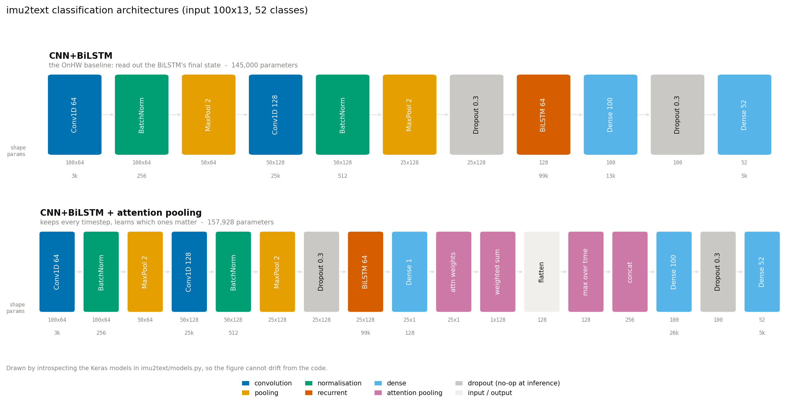

# Getting started

What this project does, why it exists, where the accuracy stands, and what to
work on next. Written to be readable end to end whether this is your first
machine-learning project or your fifteenth year of building systems.

If a term is unfamiliar, [docs/glossary.md](glossary.md) has it.

## What the problem is

A person writes on ordinary paper with an ordinary-looking ballpoint pen. The
pen contains sensors. From the sensor stream alone, produce the text they
wrote.

That is harder than it sounds, for one structural reason:

**The pen does not know where it is.** It has accelerometers and a gyroscope.
Those measure *motion*, not position. Getting from acceleration to a position
means integrating twice, and the error compounds fast enough to drift within a
single character. So the pen cannot draw what was written, and none of the
decades of image-based handwriting recognition applies to its output.

What it gives you instead is a 13-channel time series at 100 Hz:

| Channels | Sensor |
|---|---|
| 0-2 | front accelerometer, x/y/z |
| 3-5 | rear accelerometer, x/y/z |
| 6-8 | gyroscope, x/y/z |
| 9-11 | magnetometer, x/y/z |
| 12 | pen-tip force |

One character is roughly 50 timesteps of that. The task is to map a
variable-length 13-channel signal to a label.

## Why it matters

Tablets already solve handwriting recognition, and solve it well. The reason
to work on a pen is everything a tablet changes about the act of writing:

- **Handwriting practice is a motor skill.** A child learning letterforms
  needs the friction of paper and the weight of a real pen. A glass screen
  teaches a different motion. If you want to give feedback on handwriting
  without changing the handwriting, the sensor has to be in the pen.
- **Cost and scale.** A classroom of tablets is a procurement project. A
  classroom of pens is stationery.
- **No screen.** In a school setting that is a feature, not a limitation.
- **Paper is the existing workflow.** Homework, exams and forms are already
  on paper. Digitising the pen means digitising what people already do.

The application driving this repo is handwriting assessment in schools: read
what a student wrote, and eventually say something useful about how they wrote
it.

## Where the accuracy is

On the official OnHW-chars benchmark, 52 classes (A-Z and a-z), evaluated
writer-independent so every test writer is unseen:

| Model | Train % | WI Test % |
|---|--:|--:|
| CNN+BiLSTM baseline | 90.1 | 69.2 |
| + augmentation | 90.1 | 70.0 |
| + attention pooling, label smoothing, LR schedule | 92.1 | **72.5** |
| CNN+BiLSTM, Ott et al. ACM MM 2022 Table 3 | - | 68.06 |

Single seed, fold 0, CPU-only. Full tables in
[docs/benchmarks.md](benchmarks.md).

72.5% sounds low if you are used to MNIST. It is not low for this problem: 52
classes, an unseen writer, and a sensor that never observes the letter's shape.

## Current architecture



Three stages:

1. **CNN trunk.** Two Conv1D layers with batch norm and max pooling, which
   read short local patterns (a stroke direction change, a pen lift) and
   downsample time by 4. A character goes from 100 timesteps to 25.
2. **BiLSTM.** Reads those 25 steps forwards and backwards. Bidirectional
   matters because a stroke's meaning often depends on what follows it: the
   difference between `c` and `a` is what happens after the curve.
3. **Read-out.** The baseline takes the BiLSTM's final state. The better
   variant keeps all 25 steps, learns a weight for each, and takes the
   weighted average plus a max. Character identity usually turns on a few
   moments of the stroke, and where those fall varies with writing speed.

Roughly 145k parameters for the baseline, 158k with attention. Small, by
design: see the next section for why.

Sequence tasks (words, equations) use the same trunk with a CTC head, in
`imu2text/seq2seq.py`.

## What was done for accuracy

In order of how much it mattered.

**Using the real benchmark.** The repo could not open the published OnHW
archives at all: labels were stored as strings not integers, three recordings
have zero timesteps, and there was no code path to the official splits. Before
that was fixed, the only numbers available came from a 2,270-sample subset.

**Fixing the seed.** `--seed` did not pin a run. `tf.random.set_seed` does not
reach the Keras layer initialisers, so two runs at the same seed started from
different weights and landed about five points apart on the small dataset,
which is larger than most of the effects being measured. Seeding now goes
through `keras.utils.set_random_seed`, and `--deterministic` adds op
determinism for a bit-reproducible run.

**Regularisation, not capacity.** This is the load-bearing result. Going from
1xBiLSTM-64 to 2xBiLSTM-100 bought +0.4 test accuracy for +5 train accuracy.
Stacking every regulariser onto that larger model was *worse* than leaving
augmentation off, at 99.2% train. Given enough parameters the model memorises
the augmented copies too, and the augmentation stops constraining anything.

The winning configuration is the small model with every lever on: attention
pooling, augmentation, label smoothing, LR schedule. It holds train accuracy to
92.1%, eight points below the larger models, and converts that restraint into
test accuracy.

**Levers do not act alone.** Attention pooling scored 69.0 against a 69.2
baseline on its own and would have been discarded on that evidence. With
augmentation it was worth +0.9, and +3.3 once the rest joined.

## Why characters get confused

This is the most useful thing to understand before trying to improve anything.


43% of the remaining errors are a letter confused with **its own other case**:
`s`→`S`, `o`→`O`, `w`→`W`, `v`→`V`, `z`→`Z`. All twelve of the commonest
confusions are case pairs. Fold case away and the same model scores 84.3%
instead of 72.5%.

For about ten letters the two cases are the *same shape at a different size*:
C/c, O/o, S/s, U/u, V/v, W/w, X/x, Z/z, K/k, P/p. Measuring how separable they
actually are, as AUC over the test set where 0.5 is a coin flip:

| Cue | Same-shape pairs | Differently-shaped pairs |
|---|--:|--:|
| Acceleration RMS | 0.54 | 0.36-0.54 |
| Duration | 0.59 | 0.83-0.95 |

Acceleration scales as size over time squared. Writers form capitals both
larger *and* proportionally faster, so the two effects cancel and the size
information does not survive into the signal. Duration separates
differently-shaped pairs well (`A` takes much longer than `a`) and same-shape
pairs barely at all.

**This is a sensing limit, not a model limit.** No architecture recovers
information the sensor never recorded. The tell that a model has hit it: as
accuracy rose from 68.0% to 72.5%, the case share of errors went *up*, from
38.4% to 43.1%. The fixable errors are the ones that got fixed.

## What to do next

Ordered by expected value per unit of work. Each links to a tracked issue.

**Give the model context.** ([#11](https://github.com/vahinitech/imu2text/issues/11))
The single biggest available gain, and it needs no new sensor. Case in real
writing is not a property of the glyph, it is decided by position in a word:
`cat` and `Cat` differ by where the letter sits, not by how it is shaped. A
word-level CTC model with a lexicon gets case almost free. The decoder is
already written in `imu2text/words.py` and has never been run against a
trained model.

**Know when the model is guessing.** ([#13](https://github.com/vahinitech/imu2text/issues/13))
Cheapest thread here: no download, no new architecture. A 72.5% recogniser
that can flag its own uncertain 28% is usable in a classroom; one that cannot
is a demo. The question worth answering first is whether the case confusions
are *confidently* wrong. If they are already low-confidence, a system that
defers on them recovers most of that 12-point penalty in practice without
solving it.

**Average over the 30 folds.** ([#9](https://github.com/vahinitech/imu2text/issues/9))
Every number above is one seed on one fold. A few hours of CPU removes that
caveat from the whole benchmark.

**Split letter identity from case.** ([#10](https://github.com/vahinitech/imu2text/issues/10))
A 26-way head plus a binary case head matches the diagnosis directly, and lets
the case decision be calibrated or deferred separately. It may also fail
informatively: if the two heads are independent, the joint accuracy could come
out below the current model.

**Hybrid classical + deep.** ([#12](https://github.com/vahinitech/imu2text/issues/12))
Filed with a prediction of 0 to +2 points, because it works on the 57% of
errors that are not case. A null result closes the direction cheaply.

More detail in [docs/onhw_research_threads.md](onhw_research_threads.md).

## Other languages and scripts

Everything above is Latin script, from German and English data. What changes
for another language is worth thinking about before assuming the pipeline
transfers.

**What carries over unchanged.** The sensor, the 13 channels, the CNN+BiLSTM
trunk, CTC, the augmentation transforms, the whole evaluation harness. None of
it assumes anything about the alphabet.

**What has to change.**

- **The charset.** `imu2text/models.py` infers the class set from the labels,
  so a new alphabet needs no code change for classification. The seq2seq
  charset is a constant per dataset.
- **Class count.** Devanagari and Telugu have far more distinct glyph units
  than 52, and Telugu in particular composes consonant-vowel clusters. More
  classes with the same amount of data per class is a harder problem.
- **Stroke order and direction.** The model learns motion patterns, so a
  script written right to left, or one with conjunct characters formed in
  several passes, produces a different signal distribution. Nothing breaks;
  it is a different learning problem, and results from Latin script do not
  predict it.
- **Segmentation.** Scripts where characters connect (Arabic, Devanagari's
  shirorekha) make "where does one character end" less obvious. This pushes
  toward the sequence model rather than single-character classification, which
  is the direction the case-ambiguity work points anyway.

**Data exists, at smaller scale than OnHW.** Two relevant datasets:

- Sharma et al., "Dataset of inertial measurements for writing Punjabi
  characters using IMU sensors" (Data in Brief, 2024, Akal University
  Bathinda). Gurmukhi script, IMU-captured, built around writing-style
  diversity across Punjabi writers.
- Gupta and Mishra, "A Dataset of Inertial Measurement Units for Handwritten
  English Alphabets" (IIT BHU Varanasi). Collected in India, but English
  alphabets rather than an Indic script.

Neither is at OnHW's scale of 119 writers, and for a writer-independent
protocol the writer count matters more than the sample count. For a script
neither covers, a collection effort needs the protocol designed in from the
start: at least a few dozen writers, and writer identity recorded so whole
writers can be held out.

The realistic sequence is: get word-level recognition working on the existing
Latin data, then collect, then transfer.

## How to start working on it

```bash
pip install -r requirements.txt --extra-index-url https://download.pytorch.org/whl/cpu
python -m imu2text.seq2seq --demo          # verifies the pipeline, no download
pytest                                     # 173 tests, no dataset needed
```

Then download the benchmark and reproduce the headline number:

```bash
python -m imu2text.download onhw_chars --out ./data       # 896 MB, once
python -m imu2text.models --models cnn_bilstm_attn \
    --onhw-chars data/onhw-chars_2021-06-30 \
    --case both --dependency indep --fold 0 \
    --augment 2 --aug-policy extended \
    --label-smoothing 0.1 --lr-schedule --epochs 30 --error-analysis
```

About 15 minutes on 4 CPU cores. `--error-analysis` prints the confusion
breakdown, which is where to look when a change does not help.

Two rules that will save you time, both learned here the hard way:

1. **Measure the noise floor before believing an improvement.** Same config,
   same seed, twice. On the official split that spread is about 0.2 points; on
   the small OnHW-chars_L set it is about 5. A gain smaller than the spread is
   not a result. Use `--deterministic` for comparisons.
2. **A synthetic test fixture written next to the loader tests nothing about
   the real data format.** Four loaders here passed 65 tests while being
   unable to open the published archives. Real-data tests live in
   `tests/test_real_data.py`, gated on `ONHW_DATA_DIR`.

The working rules for changes are in [CLAUDE.md](../CLAUDE.md), and the
benchmarking conventions in `.claude/skills/benchmarking/SKILL.md`.
