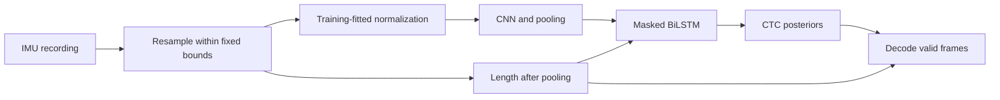

# CTC alignment and validation root-cause analysis

## Experiment question

Does correcting sequence alignment and validation improve recognition of unseen
writers on the downloaded right-handed OnHW-Words500 archive?

The planned comparison uses official writer-independent fold 0, seed 0, 15
epochs, batch size 32, two convolution blocks, and one 32-unit bidirectional
LSTM. The parent and corrected pipelines use the same official test recordings.
This smaller encoder is a CPU experiment configuration, not the CLI default.
The existing character-classification benchmark measures a different task.

The prior expectation is lower CER after fixing alignment. A CER increase of
two percentage points calls for investigation, not an improvement claim.
Repeating the same deterministic configuration measures run-to-run variation on
this archive. The corrected pipeline with random validation is an ablation of
writer-disjoint validation. No configuration is selected by test accuracy.

After the first pair showed essentially unchanged greedy metrics, a final-refit
experiment was added. Grouped validation fitted 35 writers and held out seven;
the refit uses the validation-selected epoch budget and fits all 42 official
training writers. The expectation is a CER reduction of at least two percentage
points relative to the grouped-validation model. A two-point increase would
argue against writer coverage as the explanation at this training budget.
The official test partition stays unchanged. This is a separate experiment,
not a replacement for the initial comparison.

## Root causes

### Padding was treated as recorded motion

The parent `seq2seq.run` filled every CTC input length with `maxlen // 4`.
For an 800-frame tensor, every example therefore had 200 output frames, even
when its recording was much shorter. Greedy and lexicon decoding used the same
constant, and the bidirectional LSTM processed the entire padded tail.
The median nonempty training recording is 182 frames long: 45 output frames
after pooling, against the 200 frames passed to the parent loss.

CTC could align target characters to padding, and the reverse recurrent pass
could mix padding into valid-frame features. The corrected pipeline passes
each recording's length after pooling to the loss, recurrent mask, and both
decoders. Regression tests inject predictions into the padded tail and verify
that they cannot add output characters.

### Long recordings lost their endings

Post-truncation discarded everything after frame 800 while keeping the complete
word label. In fold 0, 51 of the 19,915 nonempty training recordings exceed that
limit. The corrected preprocessing interpolates the entire recording into fixed
duration bounds, 80 to 800 frames, so the endpoints remain present.

Those bounds depend on input duration, not on target text. Upsampling a short
recording provides alignment frames but adds no sensor information. Compressing
a very long recording changes its temporal frequencies and can lose detail.
The benchmark has to establish the effect of this policy; interpolation does
not guarantee better recognition.

### The CTC feasibility check missed repeated characters

An adjacent repeated character needs an intervening blank. For example, `aa`
requires three output frames, whereas `ab` requires two. The parent checked only
the largest label length against the global padded length.

The new check requires, for each recording, at least the label length plus its
number of adjacent repeats. The downloaded fold contains two nonempty training
recordings and one nonempty test recording that cannot align after native
fourfold downsampling. Fixed duration resampling makes them feasible without
discarding them from evaluation or deriving input lengths from their labels.

### Validation did not represent unseen writers

The official Words500 test partition is writer-disjoint, but the parent carved
validation samples randomly from the training partition. Writers could appear
in both fitting and validation, so checkpoint selection answered an easier
question than final evaluation.

The corrected Words500 entry point passes the available pseudonymous writer
codes into a group split. Validation holds out training writers; the official
test partition is unchanged. A check rejects overlapping test writers when the
writer-independent protocol is requested. The ablation keeps random validation
to measure the contribution of this change separately. Archives that
deliberately share writers keep their published writer-dependent test partition
and random inner validation; the CLI reports that distinction.

### Reaching the epoch limit could bypass checkpoint restoration

The installed Keras 2.15 implementation restores best weights inside the early
stopping branch. Reaching the epoch limit before patience expires leaves the
last epoch's weights in place. `RestoreBest` also restores the recorded
validation checkpoint in `on_train_end`. This applies to character and sequence
models. A regression test finishes training without triggering early stopping
and checks that the better earlier weights are restored.

### Character-model selection consulted test accuracy

The character benchmark sorted candidates by `test_acc` and exported the first
candidate's predictions. It now ranks by `val_acc`, with stable ordering for
ties. Test scores describe the selected candidate; they do not select it.
The comparison-table runner accepts the updated result line.

## Methods introduced

Inference uses each recording's length to mask recurrence and decode valid frames:

The recognizer remains CNN + BiLSTM + CTC. These changes add per-recording
alignment lengths, explicit recurrent masking, fixed-bound linear resampling,
grouped validation, and checkpoint restoration at the epoch limit. They do not
introduce a transformer or a new recognition architecture. The lexicon prefix
beam decoder already existed; it now receives the same valid lengths as greedy
decoding. Its dictionary comes only from fitting labels.

The output alphabet comes from the published Words500 vocabulary, or from
training labels for a custom dataset, and is no longer inferred from test labels.
Normalization is still fitted on training only. Incremental scaler fitting and
direct writes into the padded tensor reduce temporary array copies.

Training copies one minibatch at a time instead of converting entire padded
partitions into additional TensorFlow arrays. Each batch trims padding beyond
its longest recording; the model accepts a variable time dimension. The shuffle
uses a seeded NumPy generator, which changes minibatch order relative to the
parent's Keras array adapter, so the aggregate comparison cannot assign every
point to masking alone. Batch normalization still sees padding inside each
minibatch, and trimming changes those training statistics too. The recurrent
mask does not make every layer padding-invariant. A separate ablation would be
needed to assign the gain to any one of these changes.

The final-refit experiment is a standard two-stage procedure: select the epoch
budget on grouped validation, then initialize a fresh model and fit the entire
official training half for that fixed budget. The former validation recordings
become training data in this second stage and are not reported as held-out
evaluation. Normalization is refitted on that final training partition. The 11
official test writers remain unseen. This adds training writers and examples
without changing the encoder architecture. With the same epoch count, the
larger fitting set also produces more optimizer updates, so this experiment
cannot separate writer coverage from the extra samples and updates.

## Dataset findings and reporting boundaries

The loader drops three empty training recordings and eight empty official test
recordings. Evaluation therefore contains 5,292 recordings, not the archive's
5,300. No additional test recordings are removed by these fixes.
The downloaded fold contains 501 distinct decoded strings across both halves,
with no empty labels or leading/trailing-whitespace variants. The code
preserves those strings instead of forcing a 500-entry vocabulary.
The extra label is `Stabilo`, present once in the archive's training half and
absent from its test half. Both halves contain the same 59-character alphabet.

CER and WER are edit rates, where lower is better. Exact word accuracy is
reported separately. The old character accuracy is not comparable to word
accuracy or to one minus CER. Single-fold, single-seed measurements do not
establish a five-fold mean or performance on Vahini's own pen hardware.

## Measurements

These word measurements use the published right-handed OnHW-Words500
writer-independent fold 0: 19,915 nonempty official training recordings, 5,292
official test recordings, and 59 character symbols. All runs use the 15-epoch,
seed-0 deterministic configuration described above.

| Comparison | CER before → after | Exact word accuracy before → after |
|---|---:|---:|
| Parent → corrected, identical random inner split | 59.30% → 55.70% | 5.54% → 7.77% |
| Parent → corrected, writer-disjoint inner validation | 59.30% → 59.31% | 5.54% → 5.50% |
| Grouped-validation model: greedy → lexicon | 59.31% → 65.35% | 5.50% → 22.77% |
| Parent → final refit, greedy | 59.30% → 53.95% | 5.54% → 8.90% |
| Final refit: greedy → lexicon | 53.95% → 56.85% | 8.90% → 32.73% |

The same-split improvement is **3.60 CER percentage points**. A paired bootstrap
resampling the 11 complete test writers, 5,000 times at seed 0, gives a 95%
interval of **1.52 to 5.67 points** of CER reduction. The initial grouped
comparison gives **−1.40 to 1.40 points**, consistent with no measured benefit.
These intervals describe this held-out writer sample, not uncertainty over
random initialization or all published folds. Repeating the parent and
grouped configurations produced identical histories and zero changed
predictions in both pairs.

The source defects are demonstrated by code and regression tests. The
same-split experiment supports a benefit from their combined correction,
including the changed batching, but does not identify masking as the sole cause.
The grouped result shows that a more appropriate validation protocol can also
reduce training writer coverage enough to hide the gain at a fixed budget.

Lexicon decoding on the grouped model recovers **914** additional exact words
and spoils none of the previous exact matches, but adds **1,744** character
edits overall. Its strict mode returns an empty result when no retained beam is
a complete word: there are **1,817** empty lexicon results against **243** empty
greedy results, including **1,599** newly empty outputs. Abstentions and
incorrect dictionary choices explain why exact word accuracy and CER can move
in opposite directions. A validation-selected fallback policy is a next
experiment, not an improvement claimed by this change.

The final refit selects epoch 15 from grouped-validation loss, initializes a
fresh model, and fits all 19,915 official training recordings from 42 writers.
Its **5.35-point** greedy CER reduction against the parent has a paired
writer-bootstrap interval of **2.77 to 7.76 points**. Relative to the grouped
model, its CER falls by **5.36 points**, exceeding the stated two-point
expectation. More complete training coverage is a plausible contributor, but
the extra examples and optimizer updates are inseparable in this experiment.
This is an additional single run after the first comparison, not a claim that
the initial comparison improved.

Final training CER is **23.70%**, against **53.95%** on unseen writers; exact word
accuracy is **32.57%** on training against **8.90%** on test, a large
generalization gap. The final lexicon recovers 1,261 additional exact words
without spoiling an exact match, but adds 837 character edits and returns 1,348
empty results. Its 32.73% word accuracy depends on the closed training
vocabulary and is not an open-vocabulary recognition figure.

The saved inference weights were reloaded into a fresh model and compared with
the in-memory model before reporting success. Their checksum and the training
normalization file are recorded in [refit_seed0.json](../results/ctc/refit_seed0.json).

The duration breakdown does not show a long-word recovery: all four test
recordings longer than 800 frames remain incorrect in both the parent and
grouped runs. Preserving their endpoints repairs the input/label mismatch but
has not established better recognition of that small subgroup. Per-duration
metrics and prediction audits are in [summary.json](../results/ctc/summary.json).

The separate character regression uses the published right-handed OnHW-chars
`both/indep/fold0` partition: 31,275 raw recordings, 23,316 nonempty official
training recordings, 7,956 test recordings, and 52 classes. Both deterministic
seed-0 runs score **72.26%**, with **zero changed predictions**. Of 2,207 errors,
957 (43.4%) are case-only confusions; case-insensitive accuracy is 84.29%.
Checkpoint restoration and validation-based candidate selection fix evaluation
behavior, but this configuration gives no character-accuracy gain.
The raw error breakdowns are in [the parent log](../results/ctc/chars_parent_seed0.txt)
and [the corrected log](../results/ctc/chars_fixed_seed0.txt).

The next experiments should use validation to choose a longer training budget
and a fallback for lexicon abstentions, then repeat across the published folds
and additional seeds. A controlled augmentation experiment could test whether
sensor orientation and writing-speed variation explain part of the writer gap.
None of these has been run.

Run-time source hashes are retained with the reports. Additional syntax hashes
ignore prose edits; the library hash for `seq2seq.py` also omits its `main`
function because the benchmark and refit call the training functions directly.
This permits the later CLI compatibility fix without changing the measured
training computation. Changes to training functions fail the source audit.

## References

- [TensorFlow CTC loss and input lengths](https://www.tensorflow.org/api_docs/python/tf/nn/ctc_loss).
- [Keras LSTM masking](https://www.tensorflow.org/api_docs/python/tf/keras/layers/LSTM).
- [Keras 2.15 callback implementation](https://github.com/keras-team/keras/blob/v2.15.0/keras/src/callbacks.py).
- [Fraunhofer OnHW dataset](https://www.iis.fraunhofer.de/de/ff/lv/dataanalytics/anwproj/schreibtrainer/onhw-dataset.html).
