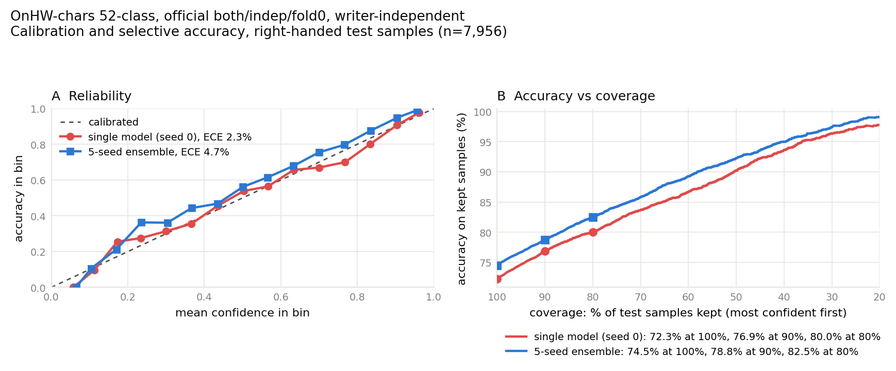

# Uncertainty, calibration and ensembles

A classifier that reads 72.5% of OnHW-chars letters correctly on unseen
writers is wrong on about one letter in four. This page covers how imu2text
measures *which* predictions to distrust, and what the ensemble runs in
`results/ensemble/` show. Everything here is on the official OnHW-chars
`both/indep/fold0` split (52 classes, writer-independent) unless a section
says otherwise. The [Vahini playground](https://playground.vahinitech.com)
shows the same models on single letters.

## What the model outputs

`imu2text.models` ends in a softmax: for each recording it gives 52
probabilities that sum to 1. The top one is the prediction, and its value is
the model's *confidence*. With `--save-predictions` the run writes the full
softmax for every test recording (`proba`, shape N × 52) next to the labels,
so every number and figure on this page can be recomputed without
retraining.

## Monte Carlo samples

One trained network gives one probability vector per recording. To ask how
sure the *model* is, as opposed to how ambiguous the *letter* is, you need
several plausible networks and you compare what they say. Each network's
output is one Monte Carlo (MC) sample. With S samples, a test set of N
recordings and C classes, the raw material is an S × N × C array of
probabilities. The prediction is the argmax of their mean, p̄.

There are four common ways to get the S networks:

| Method | How the S samples are produced | Training cost |
|---|---|---|
| Deep ensemble (Lakshminarayanan et al., NeurIPS 2017) | S networks trained from different random seeds | S full runs |
| MC dropout (Gal and Ghahramani, ICML 2016) | one network, dropout left on at test time, S forward passes | 1 run |
| SWAG (Maddox et al., NeurIPS 2019) | fit a Gaussian to the weights SGD visits late in training, draw S weight sets from it | about 1 run |
| Variational optimisers: Vadam, Vprop (Khan et al., ICML 2018), VOGN (Osawa et al., NeurIPS 2019) | the optimiser learns a mean and a variance per weight; draw S weight sets | 1 run, slower to converge |

imu2text uses a deep ensemble of S = 5 seeds. It needs no change to the
model or the optimiser: `--seed` varies the initialisation and the
augmentation, `--split-seed` holds the train/validation/test partition
fixed so the five members score the same recordings in the same order, and
`scripts/ensemble_chars.py` averages their saved probabilities. SWAG and the
variational optimisers are not implemented here.

## Two kinds of uncertainty

**Aleatoric** uncertainty is in the data. A lower-case `o` and an upper-case
`O` differ only in size, and the pen's IMU does not record absolute size well,
so even a perfect model is unsure between them. More data from the same
writers does not remove it.

**Epistemic** uncertainty is in the model. It is high where the training data
was thin, for example a writer whose style no training writer shared. The S
networks disagree there. More training data does reduce it.

Two standard ways to split total uncertainty into these parts:

- **Entropy form** (Depeweg et al., ICML 2018). Total predictive entropy
  H[p̄] = −Σ_c p̄_c log₂ p̄_c. Aleatoric part: the mean entropy of the
  individual samples, (1/S) Σ_s H[p_s]. Epistemic part, the *mutual
  information* (MI): H[p̄] − (1/S) Σ_s H[p_s]. MI is zero when all S networks
  output the same vector, whatever that vector is.
- **Covariance form** (Kwon et al., Computational Statistics & Data Analysis
  142, 2020). Per recording, a C × C matrix for each part. Aleatoric:
  (1/S) Σ_s (diag(p_s) − p_s p_sᵀ). Epistemic: (1/S) Σ_s (p_s − p̄)(p_s − p̄)ᵀ.
  Averaged over recordings, the diagonal says which letters carry the
  uncertainty and the off-diagonal says which *pairs* share it: a negative
  aleatoric entry between `o` and `O` means probability moves between those
  two.

A single network has no epistemic part by construction; its MI is exactly 0.
That is why the uncertainty figures need the ensemble.

## Calibration

A model is calibrated if, among all predictions made with 80% confidence,
80% are right. Neural networks trained with cross-entropy tend to be
overconfident (Guo et al., ICML 2017).

The **reliability diagram** sorts test predictions into 15 equal-width
confidence bins and plots each bin's accuracy against its mean confidence.
A calibrated model sits on the diagonal. **Expected calibration error (ECE)**
is the gap in each bin, weighted by the share of predictions in that bin:
ECE = Σ_b (n_b / N) |acc_b − conf_b|. It is reported in percentage points.

Label smoothing, which the 72.5% configuration uses, pulls confidences down
and changes ECE by itself, so ECE is only compared between runs trained with
the same smoothing.

## Selective prediction

If the model may decline to answer, sort the test recordings by confidence
and score only the most confident fraction. Accuracy against *coverage*
(the fraction kept) shows what abstention buys: at 100% coverage it is the
ordinary test accuracy. A number at lower coverage is always quoted with its
coverage, never on its own, since keeping only the easy half of the test set
is not the same task.

## Figures

`scripts/plot_uncertainty.py` draws two panels from saved predictions:
the reliability diagram with ECE for one member and for the ensemble, and
accuracy against coverage for both. It also writes every plotted point to
`<out>_curves.csv`, so the figure has a table view.

Planned, not yet drawn:

- **Uncertainty heatmaps.** The 52 × 52 aleatoric and epistemic matrices
  from the covariance form, next to the confusion matrix. The existing error
  figure (`results/error_analysis.png`) already shows the confusion matrix,
  row-normalised with the diagonal removed.
- **Entropy and MI per letter.** One bar per class, to check whether the
  case-confused letters are also the uncertain ones.
- **Per writer.** The right-handed `.npy` archive ships no writer IDs, so
  per-writer uncertainty cannot be computed on the official split. Guessing
  writer boundaries from the order of labels in the test file would depend on
  how the archive happens to be sorted, and is not done here. The
  left-handed archive (`OnHW-chars_L`) has real writer IDs for its 9 writers,
  so per-writer plots are possible there.

## Results

Official OnHW-chars `both/indep/fold0` split, 52 classes, writer-independent.
`cnn_bilstm_attn` with augmentation ×2 (`extended`), label smoothing 0.1 and
the LR schedule, 30 epochs, `--deterministic`, split seed 0, member seeds 0 to
4. Every number below is in `results/ensemble/summary.md`, computed from the
saved predictions in `results/ensemble/`.

| Training data | Test letters | Single models: mean (range) | 5-seed ensemble | Ensemble, case-insensitive | ECE single → ensemble |
|---|---|--:|--:|--:|--:|
| Official right-handed train | 7,956 right-handed | 72.18% (71.85 to 72.66) | **74.46%** | 86.14% | 2.29 → 4.71 |
| Plus OnHW-chars_L train writers | 7,956 right-handed | 72.16% (71.34 to 72.67) | 74.92% | 86.55% | 2.28 → 5.66 |
| Plus OnHW-chars_L train writers | 417 left-handed | 53.76% (52.28 to 56.12) | 59.47% | 68.11% | 6.89 → 7.77 |

**The ensemble helps.** It is 2.28 points above the average single model and
1.80 above the best seed. On the same 7,956 letters it is right where the
best seed is wrong 432 times, and wrong where the best seed is right 289
times (McNemar, p = 1.1e-7).

**Left-handed training data does not measurably help right-handed writers.**
Single models average 72.16% with it and 72.18% without. The ensemble gains
0.47 points, but the two disagree on 593 letters, 315 to 278 in its favour
(McNemar, p = 0.14), and a bootstrap over test letters gives a 95% interval
of −0.15 to +1.04 points. The test file has no writer IDs, so writers are not
resampled and the real interval is wider.

**Left-handed writers do gain from it.** The pooled ensemble reads 59.47% of
the 417 left-handed test letters, on a split of OnHW-chars_L's 9 writers
built here. Trained on OnHW-chars_L alone, the model scored 26.86% on a
constructed writer-independent split (`docs/benchmarks.md`); the two splits
may hold out different writers, so treat the comparison as indicative.

**The ensemble is underconfident.** A single model is close to calibrated:
mean confidence 72.32% at 72.26% accuracy. The ensemble's mean confidence is
69.75% at 74.46% accuracy. Averaging five models spreads probability over
more letters, on top of what label smoothing already does. Temperature
scaling fitted on the validation set would correct it; these runs saved test
outputs only, so that is the next step.

**Abstaining buys accuracy.** Keeping the ensemble's 90% most confident
letters gives 78.8% accuracy on them, and 80% gives 82.5% (single model:
76.9% and 80.0%). Every point of panel B is in
`results/uncertainty_curves.csv`.

Each member took about 20 minutes on four CPU cores with `--deterministic`
and peaked at 2.3 to 2.6 GB of memory, so the ensemble costs five times one
model. One fold and one split seed: the numbers carry that caveat.

## Evaluation rules for this work

These apply to any uncertainty or ensemble experiment in this repo:

- Validation comes from the training writers only. Early stopping, model
  selection, hyperparameter search and temperature scaling never see a test
  writer.
- Normalisation statistics are fitted on the training set only.
- BatchNorm statistics are never re-estimated on the test set.
- Ensemble members are averaged with equal weight. Choosing members or
  weights by test accuracy turns the test set into a validation set.
- A reported accuracy is the accuracy of p̄, the averaged prediction, not
  the average accuracy of the individual samples.

## Hyperparameter search with Bayesian optimisation

The 72.5% configuration was tuned by hand. Bayesian optimisation (Snoek,
Larochelle and Adams, NeurIPS 2012) replaces that with a loop: fit a
Gaussian-process model of validation accuracy as a function of the
hyperparameters, pick the next configuration where that model expects the
most gain, train, repeat. Libraries such as Ax/BoTorch and Optuna implement
it.

It is not set up here. On this machine one 30-epoch run takes 15-20 minutes,
so a 40-trial search is 10-13 hours of CPU. If it is added, the objective is
validation accuracy on held-out *training* writers, and the test split is
scored once, after the search ends.

## Storing trained models

Weights stay out of git (`.gitignore` excludes `results/ctc/*.weights.h5`);
each run's predictions, which are small, are committed instead. To share
weights for a public repo, the free options are a GitHub release asset
(files up to 2 GiB each), a Zenodo record (a DOI per upload, up to 50 GB per
record) or a Hugging Face model repository. Check the current limits before
relying on them. University sync services are usually restricted to that
university's members, which makes them a poor fit for an open-source
project.

## References

- Depeweg, Hernández-Lobato, Doshi-Velez, Udluft. Decomposition of
  Uncertainty in Bayesian Deep Learning for Efficient and Risk-sensitive
  Learning. ICML 2018.
- Gal, Ghahramani. Dropout as a Bayesian Approximation. ICML 2016.
- Guo, Pleiss, Sun, Weinberger. On Calibration of Modern Neural Networks.
  ICML 2017.
- Khan, Nielsen, Tangkaratt, Lin, Gal, Srivastava. Fast and Scalable
  Bayesian Deep Learning by Weight-Perturbation in Adam. ICML 2018.
- Kwon, Won, Kim, Paik. Uncertainty quantification using Bayesian neural
  networks in classification: Application to biomedical image
  segmentation. Computational Statistics & Data Analysis 142, 2020.
- Lakshminarayanan, Pritzel, Blundell. Simple and Scalable Predictive
  Uncertainty Estimation using Deep Ensembles. NeurIPS 2017.
- Maddox, Garipov, Izmailov, Vetrov, Wilson. A Simple Baseline for Bayesian
  Uncertainty in Deep Learning. NeurIPS 2019.
- Osawa, Swaroop, Jain, Eschenhagen, Turner, Yokota, Khan. Practical Deep
  Learning with Bayesian Principles. NeurIPS 2019.
- Snoek, Larochelle, Adams. Practical Bayesian Optimization of Machine
  Learning Algorithms. NeurIPS 2012.
